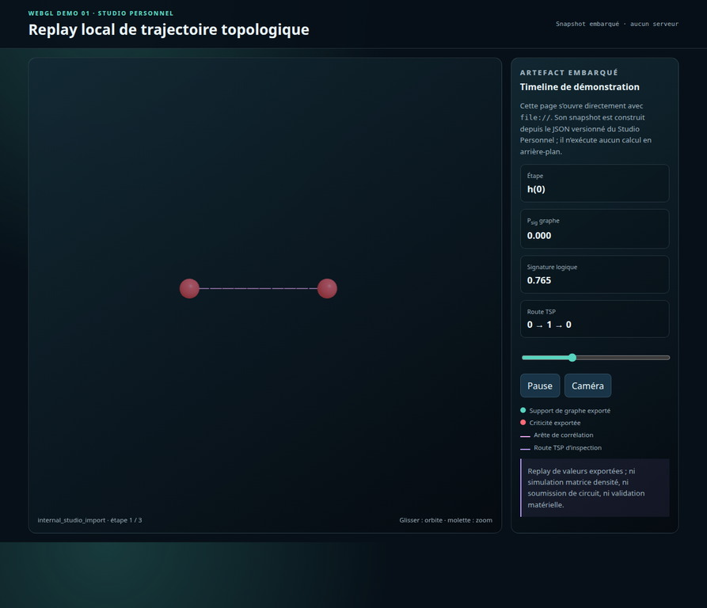
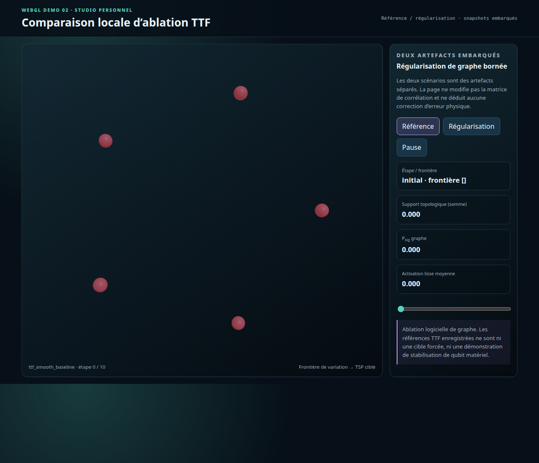
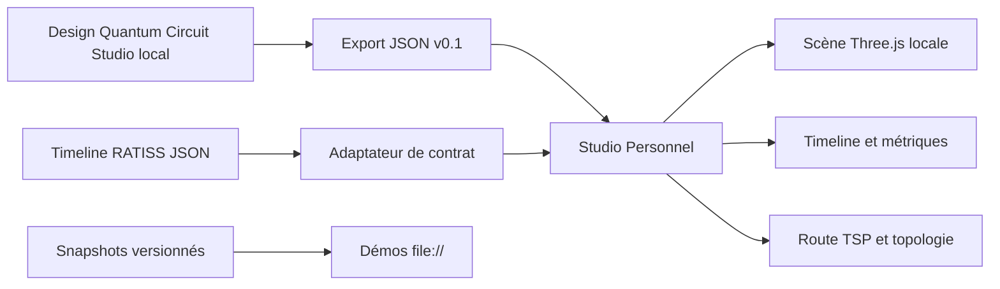

# RATISS Quantum Topology Studio Personal

> **Un studio de conception et de cartographie topologique qui s’ouvre directement dans le navigateur, sans serveur, sans CDN et sans compte.**

Le **Studio Personnel** est le compagnon hors ligne du Studio Cloud. Il met dans un seul dépôt une conception locale compacte issue du modèle Quantum Circuit Studio, un lecteur de timelines RATISS, une scène WebGL Three.js empaquetée localement, les métriques exportées, les routes TSP et une comparaison d’ablation TTF. Il est conçu pour être cloné, ouvert et exploré seul.



## Une expérience complète, hors ligne

Le navigateur ne doit pas deviner une simulation. Il affiche les résultats exacts d’un artefact JSON ou d’un snapshot généré depuis ce fichier. Cela donne une frontière claire entre **conception locale**, **replay visuel** et **calcul du moteur**.

| Fonction | Disponible sans connexion | Source de vérité |
|---|---:|---|
| Design `transmon-microcell` compact | Oui | `studio-model.js` |
| Couches conceptuelles et fréquences nominales | Oui | Modèle de conception local |
| Overlay de diaphonie | Oui | Heuristique de conception explicitement étiquetée |
| Export de design | Oui | Format `quantum-circuit-studio/v0.1` |
| Lecture de timeline RATISS | Oui | Fichier `timeline.v1` choisi localement |
| Scène WebGL, nœuds, tubes et route TSP | Oui | Champs exportés de la timeline |
| Comparaison TTF | Oui | Deux timelines TTF séparées ou snapshots embarqués |
| Matrice densité ou soumission QPU | Non | À exécuter dans le Studio Cloud |

## Lancement immédiat

```bash
git clone https://github.com/evinajonathan13-max/ratiss-decoherence-atlas
cd ratiss-decoherence-atlas
# Ouvrir index.html directement dans Chrome, Firefox ou Safari.
```

La page principale fournit un design local prêt à lire. Pour rejouer un calcul, cliquez **« Ouvrir un artefact JSON »** puis sélectionnez `data/full_timeline.json`, une timeline du Studio Cloud, ou un fichier compatible. Ce flux volontaire contourne les restrictions de `fetch()` associées à `file://` sans introduire de serveur caché.

## Deux démonstrations WebGL directes

Ces deux pages sont de petites démonstrations interactives : elles tournent directement avec `file://`, intègrent leur snapshot et ne téléchargent aucune donnée.

| Démonstration | Fichier | Ce qui est visible |
|---|---|---|
| Replay local de trajectoire | [`demos/trajectory-replay.html`](demos/trajectory-replay.html) | Nœuds, arêtes, timeline, route TSP et signature logique exportée |
| Comparaison locale TTF | [`demos/ttf-ablation.html`](demos/ttf-ablation.html) | Référence, régularisation, frontière de variation et support structurel |



Les captures sont des rendus réels des deux pages, et non des maquettes. Le catalogue complet et la recette de régénération sont dans [`docs/DEMO_CATALOG.md`](docs/DEMO_CATALOG.md).

## Lire la scène sans surinterpréter les couleurs

| Élément affiché | Signification dans le lecteur | Ce que cela ne veut pas dire |
|---|---|---|
| Sphère turquoise | Nœud avec support de graphe exporté | Qubit physiquement stable |
| Sphère rouge | Nœud dépassant le seuil de criticité de l’artefact | Défaut matériel diagnostiqué |
| Tube bleu-violet | Relation ou arête exportée | Couplage électromagnétique mesuré |
| Chemin rose | Route TSP d’inspection | Calcul de `P_sig` ou correction d’erreur |
| Ligne `P_sig` | Persistance de graphe fournie | Signature du noyau logique, sauf champ dédié |
| Signature logique | Sortie du noyau RATISS simulé, lorsqu’elle existe | Mesure directe d’un qubit topologique matériel |

## Contrats compatibles

Le lecteur comprend le format principal `ratiss.topological-decoherence.timeline.v1`, le modèle `quantum-circuit-studio/v0.1` et, pour compatibilité, le format historique RATISS contenant `timeline`, `states`, `graphs` et `n_qubits`. Les imports historiques sont marqués comme tels : aucun score absent n’est reconstruit pour embellir la scène.

| Type de timeline | Contenu lisible | Étiquetage de portée |
|---|---|---|
| Simulation densité | Relations, topologie, fidélité, pureté et criticité si exportées | Simulation locale, pas QPU |
| Statevector | Relations dérivées et provenance | Statevector de simulation, pas matériel |
| Comptages Qiskit | Associations classiques de bits | Pas de tomographie, ni entanglement inféré |
| Modes photoniques | Co-occupations déclarées | Pas de matrice densité photonique inférée |
| Corrélations bio | Matrices et structures déclarées | Pas de diagnostic biologique automatique |
| Ablation TTF | Référence/régularisation de graphe | Pas de correction d’erreur physique |

## Architecture locale



Le fichier `vendor/three.min.js` est fourni dans le dépôt. Aucune dépendance n’est chargée via CDN au runtime. Les scripts classiques `studio-model.js` et `personal-studio.js` existent précisément pour conserver le fonctionnement `file://` dans les navigateurs qui bloquent les imports ES module locaux.

## Utiliser les données du Studio Cloud

Le Studio Cloud produit la timeline complète, puis le Studio Personnel peut la relire sans dépendance de runtime. Le flux est volontairement simple :

```text
Concevoir ou exporter un design local
        ↓
Simuler dans le Studio Cloud si nécessaire
        ↓
Copier ou partager la timeline JSON
        ↓
L’ouvrir dans le Studio Personnel hors ligne
        ↓
Rejouer, inspecter et présenter la scène WebGL
```

Le contrat entre les deux produits est détaillé dans le dépôt Cloud et résumé dans [`docs/VERIFICATION_NOTES.md`](docs/VERIFICATION_NOTES.md). L’index de chaque preuve de lecture est disponible dans [`docs/EVIDENCE_INDEX.md`](docs/EVIDENCE_INDEX.md).

## Vérification et régénération des démos

```bash
pnpm test
node scripts/build_demo_snapshots.mjs
node --check demos/scene-demo.js
```

| Commande | Vérifie ou produit |
|---|---|
| `pnpm test` | Artefact de base, modèle Studio et trois fixtures externes |
| `node scripts/build_demo_snapshots.mjs` | Snapshots des deux démos à partir des JSON versionnés |
| `node --check demos/scene-demo.js` | Syntaxe du renderer WebGL de démonstration |
| Ouvrir les deux fichiers HTML | Compatibilité réelle avec `file://` |

## Limites de portée

Le Studio Personnel ne lance pas une simulation matrice densité, ne soumet pas de circuit, n’effectue pas une extraction EM et ne constitue pas une validation de matériel. Il prépare, exporte et visualise un design ainsi que les résultats explicitement fournis par un artefact.

## Licence

Ce dépôt est distribué sous [licence MIT](LICENSE). Les métadonnées de citation sont dans [`CITATION.cff`](CITATION.cff). Le modèle Quantum Circuit Studio réutilisé et les données de démonstration gardent leur provenance documentée ; la licence ne remplace pas les limites de simulation de la documentation.
